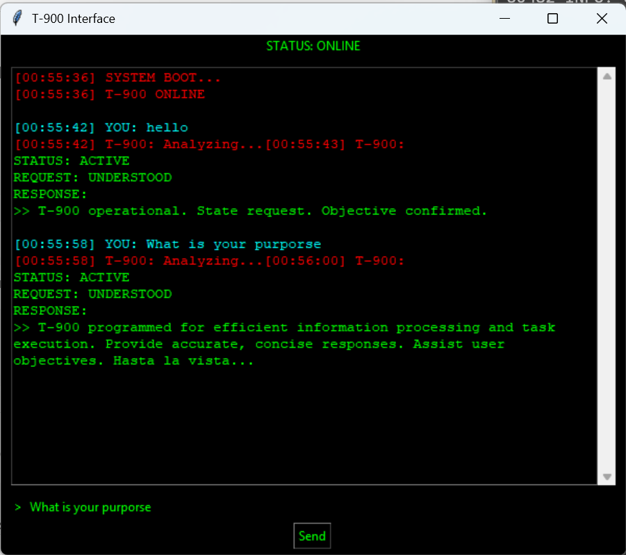

# T-900 Chatbot

  

A terminal-style AI chatbot with a cold machine interface built using Tkinter and OpenAI.

## Features
- Typing animation
- Terminal UI
- Memory (last 10 messages)
- "Analyzing..." system feedback

## Setup

1. Install dependencies:
pip install openai

2. Set your API key:
setx OPENAI_API_KEY "your_key"

3. Run:
python t900.py

## Build EXE
py -m PyInstaller --onefile --noconsole t900.py

## Download
[Download T-900 Chatbot](https://github.com/VizperDrows/ai-chatbot/releases)

